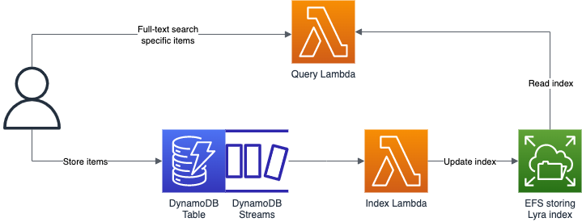

# DynamoDB full-text search

The repository contains sample code for indexing a DynamDB table using DynamoDB Streams into Lyra (a full-text search engine) persisted on EFS and creating a Lambda function with a public URL to query the index.

The solution should be easily deployable with the provided Terraform configuration.

## Architecture

Created by Vass Bence in 2023, released under the MIT license.
